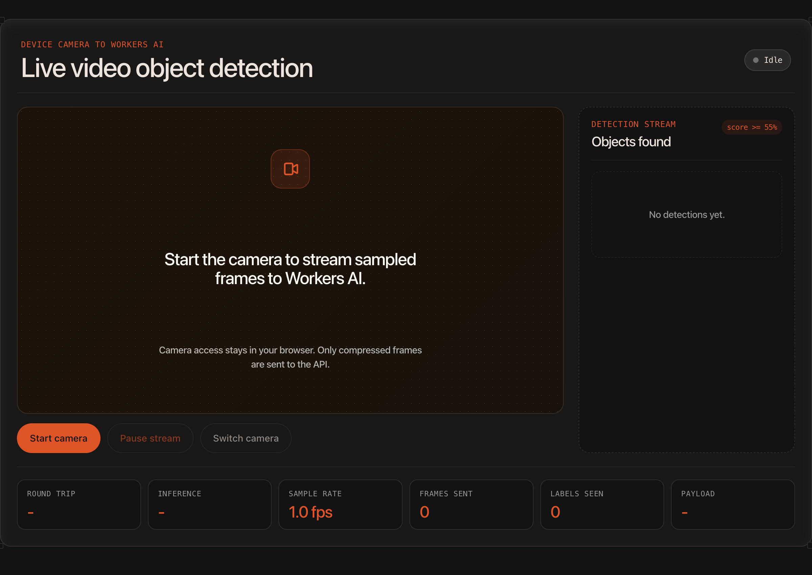

# Cloudflare Video Detection Demo

Astro + Cloudflare Workers demo that captures device-camera frames, sends sampled JPEG frames to **Workers AI**, and draws object-detection boxes over the live video feed in real time.

It ships as an **open, rate-limited public demo** — anyone can try it without signing in — and as a clean starter you can deploy yourself, where none of the demo limits apply.



- **Live demo:** https://video-detection.cloudflare.app/
- **Source:** https://github.com/Gryczka/cloudflare-video-detection-demo

## Demo views

| Route | View | Models |
| --- | --- | --- |
| `/` | Live object detection | `@cf/facebook/detr-resnet-50` |
| `/zone` | Draw a zone and log person-entry events | `@cf/facebook/detr-resnet-50` + browser geometry |
| `/ppe` | Detect people missing selected headwear | `@cf/facebook/detr-resnet-50` + selectable vision model |
| `/architecture` | Reference architecture + demo-limit disclosure | — |

The PPE view can assess headwear compliance with:

- `@cf/meta/llama-3.2-11b-vision-instruct`
- `@cf/llava-hf/llava-1.5-7b-hf`
- `@cf/google/gemma-4-26b-a4b-it`

## Open public demo & rate limits

Because the hosted demo is public and unauthenticated, it bounds Workers AI spend with cost guardrails. **A cutoff you see in the hosted demo is a demo guardrail, not a product limitation** — when you deploy this project yourself these limits don't exist.

| Guardrail | Demo default | Enforced by |
| --- | --- | --- |
| Object detection, per session | 90 / minute | Workers Rate Limiting binding (`RL_DETECT`) |
| PPE vision checks, per session | 6 / minute | Workers Rate Limiting binding (`RL_PPE`) |
| Object detection, global | 50,000 / UTC day | `BudgetCounter` Durable Object |
| PPE vision checks, global | 2,000 / UTC day | `BudgetCounter` Durable Object |
| Sample rate | ~1 fps | client (down from 1.5 fps) |
| PPE vision model | on demand (manual "Analyze frame") | client, demo mode only |

All of this is gated behind a single switch, `PUBLIC_DEMO_MODE` (default `"true"`). Set it to `"false"` for a production / self-hosted deployment and every guardrail above is bypassed, the disclosure banner is hidden, and PPE returns to a continuous loop.

## How it works

1. The browser starts `getUserMedia()` and renders the camera stream into a video element.
2. A client-side canvas samples frames at ~1 fps and sends compressed JPEG frames to `/api/detect`.
3. The Astro API route applies the demo guardrails, then calls `env.AI.run('@cf/facebook/detr-resnet-50', { image })`.
4. The browser receives detections and draws bounding boxes plus confidence labels on a canvas overlay.
5. `/zone` uses person boxes to compute zone overlap and logs transitions in memory.
6. `/ppe` calls `/api/ppe?model=<llama|llava|gemma>` — on demand in the public demo, or on a loop when self-hosted.

## Architecture & bindings

A single Worker (custom entrypoint `src/worker.ts`, which wraps Astro's `handle()`):

| Binding | Type | Purpose |
| --- | --- | --- |
| `AI` | Workers AI | DETR + vision model inference |
| `ASSETS` | Static assets | Serves the built Astro site |
| `RL_DETECT`, `RL_PPE` | Rate Limiting | Per-session demo rate limits |
| `BUDGET` | Durable Object (`BudgetCounter`) | Global per-UTC-day spend cap |
| `ANALYTICS` | Analytics Engine | One data point per inference (endpoint, country, colo, city, model, outcome, latency, bytes) |
| `EMAIL` | Email Service | Monthly + daily usage reports |

```
Browser (camera + canvas overlay)
    │  ~1 fps JPEG over HTTPS
    ▼
Astro API routes (/api/detect, /api/ppe)
    ├── RL_DETECT / RL_PPE   per-session rate limit
    ├── BUDGET (Durable Object)  global daily cap
    ├── env.AI.run(...)      DETR / vision model
    └── ANALYTICS.writeDataPoint(...)
                                    │
            cron (scheduled handler)│  monthly + daily
                                    ▼
            Analytics Engine SQL API ──► EMAIL.send(report)
```

## Usage analytics & email reports

Every inference writes one Analytics Engine data point, so you can see **where** traffic comes from (country / colo / city) and **how much** there is (per endpoint, per day), including how often requests were rate-limited or hit the daily cap.

The Worker's `scheduled()` handler emails reports (configurable in `wrangler.jsonc` `vars`):

- **Monthly summary** (`0 14 1 * *`): always sent; subject escalates to `[ALERT]` when monthly inferences exceed `USAGE_ALERT_THRESHOLD`.
- **Daily spike alert** (`0 14 * * *`): sent only when the prior day's inferences exceed `DAILY_SPIKE_THRESHOLD`.

Reports are sent from `REPORT_EMAIL_FROM` to `REPORT_EMAIL_TO`. Two prerequisites for sending:

1. Onboard the send-from domain once: `npx wrangler email sending enable <yourdomain>`
2. Create an API token with **Account Analytics: Read** and store it as a secret so `scheduled()` can query the SQL API:
   ```sh
   npx wrangler secret put AE_SQL_API_TOKEN
   ```

## Self-hosting / production

This repo is meant to be cloned and deployed. For a private or production deployment:

1. Set `PUBLIC_DEMO_MODE` to `"false"` in `wrangler.jsonc` (removes all demo caps, hides the banner, restores continuous PPE).
2. Optionally remove the `ratelimits`, `durable_objects`/`migrations`, `analytics_engine_datasets`, `send_email`, and `triggers` config if you don't want usage reporting — the code degrades gracefully when a binding is absent.
3. **Optional access control:** put the Worker behind [Cloudflare Access](https://developers.cloudflare.com/cloudflare-one/policies/access/) (e.g. restrict to your email domain) in the Zero Trust dashboard. Access is configured at the platform level, not in this repo.

## Development

Workers AI bindings are remote, so Wrangler needs to know which Cloudflare account to use when more than one account is logged in.

```sh
CLOUDFLARE_ACCOUNT_ID=<account_id> npm run dev
```

Then open `http://localhost:4321` and start the camera. (Demo guardrails are generous enough that local development never hits them; reporting bindings are inert locally.)

To exercise the cron reports locally:

```sh
npx wrangler dev --test-scheduled
# then trigger a schedule:
curl "http://localhost:8787/cdn-cgi/handler/scheduled?cron=0+14+1+*+*"
```

## Build

```sh
CLOUDFLARE_ACCOUNT_ID=<account_id> npm run build
```

The build regenerates `worker-configuration.d.ts` before running Astro.

## Deploy

```sh
CLOUDFLARE_ACCOUNT_ID=<account_id> npm run deploy
```

The hosted demo is served at both `video-detection.cloudflare.app` and the account's `workers.dev` subdomain.

## Llama Vision license

`@cf/meta/llama-3.2-11b-vision-instruct` requires a one-time license agreement per Cloudflare account. The PPE endpoint lazily sends `{ prompt: "agree" }` and retries if Workers AI returns a license-agreement error on the first Llama request.
